# MinMod Ontology Extensions - Visual Diagram

This diagram shows how the proposed geochemistry extensions integrate with the existing MinMod ontology.

## High-Level Architecture

```mermaid
graph TB
    subgraph "Existing MinMod Ontology v2.1.1"
        MS[MineralSite<br/>📍 Location, name, type]
        MI[MineralInventory<br/>📊 Grade, tonnage, category]
        COM[Commodity<br/>💎 Elements]
        REF[Reference<br/>📄 Provenance]
        MEAS[Measure<br/>📏 Value + Unit]
        DOC[Document<br/>📚 Publication]
    end

    subgraph "NEW: Geochemistry Extensions"
        GS[GeochemicalSample<br/>🧪 Individual rock sample]
        AM[AnalyticalMethod<br/>🔬 LA-ICP-MS, EPMA, etc.]
        GM[GeochemicalMeasurement<br/>⚗️ Element concentration]
        ISO[Isotope<br/>⚛️ Sr-87, Pb-206, etc.]
        AGG[AggregatedTraceElementData<br/>📈 Statistical summary]
        MIN[Mineral<br/>💠 Sphalerite, Galena, etc.]
    end

    %% Core relationships - Sample to Site
    GS -->|from_mineral_site| MS
    GS -->|analyzed_by_method| AM
    GS -->|has_measurement| GM
    GS -->|sample_mineral| MIN
    GS -->|reference| REF

    %% Measurement relationships
    GM -->|measured_element| COM
    GM -->|concentration| MEAS
    GM -->|isotope| ISO
    GM -->|detection_limit| MEAS

    %% Aggregation relationships
    AGG -->|for_mineral_site| MS
    AGG -->|source_samples| GS
    AGG -->|element| COM
    AGG -->|median/mean/min/max| MEAS

    %% Integration with existing inventory
    MI -.->|derived_from_samples| AGG
    MS -.->|geochemical_samples| GS

    %% Other relationships
    ISO -->|parent_element| COM
    MIN -->|contains_element| COM
    REF -->|document| DOC

    style MS fill:#B3D9FF
    style MI fill:#B3D9FF
    style COM fill:#B3D9FF
    style REF fill:#B3D9FF
    style MEAS fill:#B3D9FF
    style DOC fill:#B3D9FF

    style GS fill:#A5D6A7
    style AM fill:#A5D6A7
    style GM fill:#A5D6A7
    style ISO fill:#A5D6A7
    style AGG fill:#A5D6A7
    style MIN fill:#A5D6A7
```



## Detailed Data Flow

```mermaid
flowchart LR
    subgraph "Academic Publication"
        PUB[📄 Journal Article<br/>with Tables]
    end

    subgraph "Sample Level"
        S1[Sample: CUM1<br/>Type: Black-banded<br/>Location: Copperhead mine]
        S2[Sample: YM1<br/>Type: Yellow<br/>Location: Young mine]
        AM1[Method: LA-ICP-MS<br/>Lab: Carlton University]
    end

    subgraph "Measurement Level"
        M1[Zn: 63.0%]
        M2[Fe: 2578 ppm]
        M3[Ga: 30 ppm]
        M4[Ge: 10 ppm]
        M5[Mn: <5 ppm<br/>below detection]
    end

    subgraph "Aggregation Level"
        AGG1[Copperhead Mine<br/>Median Ga: 30 ppm<br/>n=15 samples<br/>range: 20-100 ppm]
    end

    subgraph "Integration Level"
        SITE[MineralSite:<br/>Copperhead Mine<br/>Tennessee, USA]
        INV[MineralInventory:<br/>Gallium grade<br/>from samples]
    end

    PUB -->|Extract| S1
    PUB -->|Extract| S2
    S1 -->|analyzed by| AM1
    S2 -->|analyzed by| AM1

    S1 -->|has measurement| M1
    S1 -->|has measurement| M2
    S1 -->|has measurement| M3
    S1 -->|has measurement| M5
    S2 -->|has measurement| M4

    S1 -->|aggregate| AGG1
    S2 -->|aggregate| AGG1

    AGG1 -->|for site| SITE
    AGG1 -->|derives| INV
    S1 -->|from site| SITE

    style S1 fill:#A5D6A7
    style S2 fill:#A5D6A7
    style AM1 fill:#A5D6A7
    style M1 fill:#FFE082
    style M2 fill:#FFE082
    style M3 fill:#FFE082
    style M4 fill:#FFE082
    style M5 fill:#FFCDD2
    style AGG1 fill:#CE93D8
    style SITE fill:#B3D9FF
    style INV fill:#B3D9FF
```



## Class Hierarchy and Relationships

```mermaid
classDiagram
    class MineralSite {
        <<Existing>>
        +name: string
        +site_type: string
        +location_info: LocationInfo
        +mineral_inventory: MineralInventory[]
        +geochemical_samples: GeochemicalSample[] ✨NEW
    }

    class GeochemicalSample {
        <<NEW>>
        +sample_identifier: string
        +sample_type: string
        +collection_location: string
        +collection_date: dateTime
    }

    class AnalyticalMethod {
        <<NEW>>
        +method_name: string
        +method_description: string
        +accuracy_notes: string
    }

    class GeochemicalMeasurement {
        <<NEW>>
        +below_detection_limit: boolean
        +measurement_note: string
    }

    class Isotope {
        <<NEW>>
        +mass_number: integer
        +isotope_notation: string
    }

    class AggregatedTraceElementData {
        <<NEW>>
        +aggregation_method: string
        +sample_count: integer
    }

    class MineralInventory {
        <<Existing>>
        +grade: Measure
        +ore: Measure
        +category: Category
        +derived_from_samples: AggregatedTraceElementData ✨NEW
    }

    class Commodity {
        <<Existing>>
        +label: string
    }

    class Measure {
        <<Existing>>
        +value: decimal
        +unit: Unit
    }

    class Reference {
        <<Existing>>
        +document: Document
        +page_info: PageInfo[]
    }

    MineralSite "1" --> "*" GeochemicalSample : from_mineral_site
    GeochemicalSample "1" --> "1..*" AnalyticalMethod : analyzed_by_method
    GeochemicalSample "1" --> "1..*" GeochemicalMeasurement : has_measurement
    GeochemicalMeasurement "*" --> "1" Commodity : measured_element
    GeochemicalMeasurement "*" --> "0..1" Isotope : isotope
    GeochemicalMeasurement "*" --> "1" Measure : concentration
    GeochemicalMeasurement "*" --> "0..1" Measure : detection_limit
    Isotope "*" --> "1" Commodity : parent_element
    AggregatedTraceElementData "1" --> "*" GeochemicalSample : source_samples
    AggregatedTraceElementData "*" --> "1" MineralSite : for_mineral_site
    AggregatedTraceElementData "*" --> "1" Commodity : element
    AggregatedTraceElementData "*" --> "*" Measure : statistics
    MineralInventory "0..1" --> "0..1" AggregatedTraceElementData : derived_from_samples
    GeochemicalSample "*" --> "*" Reference : reference
```



## Integration Points

### 🔗 Extension Point 1: MineralSite → GeochemicalSample
**Purpose**: Link mineral sites to their analyzed samples
**Property**: `geochemical_samples` (new property)
**Cardinality**: 1 site → many samples
**Use Case**: "Show all samples collected from Copperhead mine"

### 🔗 Extension Point 2: MineralInventory → AggregatedTraceElementData
**Purpose**: Connect inventory data to supporting sample evidence
**Property**: `derived_from_samples` (new property)
**Cardinality**: 1 inventory → 0..1 aggregation
**Use Case**: "What samples support the reported Gallium grade?"

### 🔗 Extension Point 3: GeochemicalMeasurement → Commodity
**Purpose**: Link measurements to elements in existing commodity catalog
**Property**: `measured_element` (new property)
**Cardinality**: Many measurements → 1 commodity
**Use Case**: "Find all Germanium measurements across all samples"

### 🔗 Extension Point 4: Reference → Academic Publications
**Purpose**: Track provenance to journal articles
**Property**: Existing `reference` property, extended domain
**Cardinality**: Many samples → many references
**Use Case**: "Which publication reported this sample data?"

## Example Instance Diagram


## Key Insights from Diagram

### 🎯 Design Goals Achieved

1. **Preserve Existing Structure**: All existing classes (blue) remain unchanged
2. **Clean Integration**: New classes (green) connect at well-defined extension points
3. **Bidirectional Traceability**: Can navigate from site → samples → measurements OR from measurements → samples → site
4. **Flexible Aggregation**: Sample data can be aggregated to site level while preserving individual measurements
5. **Full Provenance**: Every sample and measurement links back to academic publication

### 📊 Data Granularity Levels

| Level | Class | Purpose | Example |
|-------|-------|---------|---------|
| **Publication** | Reference, Document | Source material | Paradis et al. (2023) |
| **Sample** | GeochemicalSample | Individual analysis | Sample CUM1 from Copperhead mine |
| **Measurement** | GeochemicalMeasurement | Element concentration | Ga: 30 ppm in sample CUM1 |
| **Aggregation** | AggregatedTraceElementData | Statistical summary | Median Ga: 30 ppm (n=15 samples) |
| **Inventory** | MineralInventory | Site-level resource | Copperhead mine Ga grade estimate |

### 🔄 Common Query Patterns

```
Pattern 1: Sample Details
MineralSite → geochemical_samples → GeochemicalSample → has_measurement → GeochemicalMeasurement

Pattern 2: Trace Back to Source
MineralInventory → derived_from_samples → AggregatedTraceElementData → source_samples → GeochemicalSample → reference → Reference

Pattern 3: Find All Measurements for Element
Commodity ← measured_element ← GeochemicalMeasurement ← has_measurement ← GeochemicalSample

Pattern 4: Quality Assessment
GeochemicalSample → analyzed_by_method → AnalyticalMethod (check accuracy_notes)
```

## Color Legend

- 🔵 **Blue** = Existing MinMod classes (no changes)
- 🟢 **Green** = New proposed classes for geochemistry
- 🟡 **Yellow** = Measurement instances (data points)
- 🔴 **Red** = Below-detection-limit measurements
- 🟣 **Purple** = Aggregated/computed data

## Implementation Phases


---

**Generated from**: `PROPOSED_ONTOLOGY_EXTENSIONS.md`
**Based on**: STTR Proposal "Modeling Sparse and Heterogeneous Geochemistry Data"
**Date**: 2026-02-19
