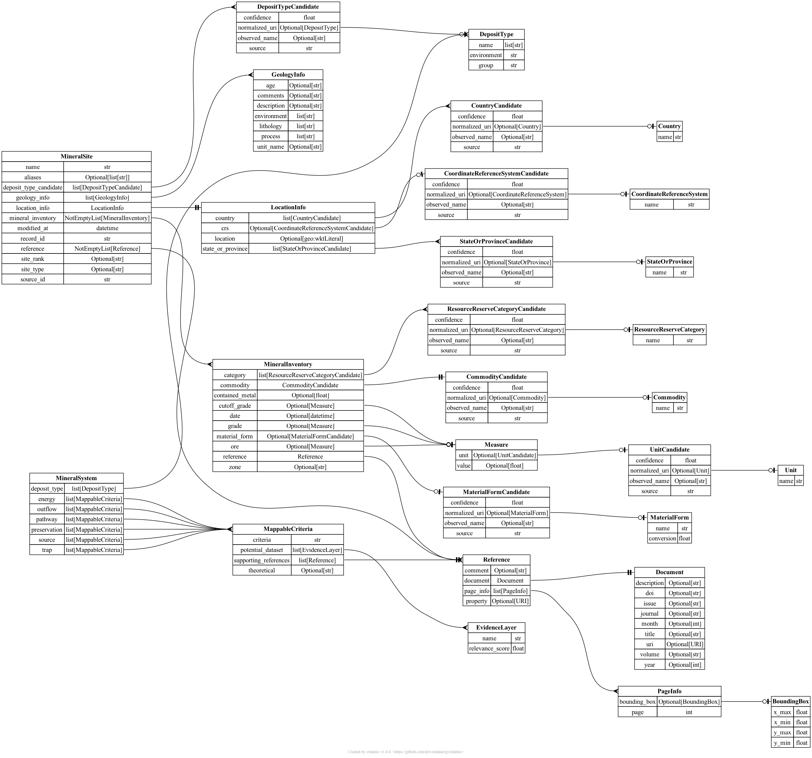

# Overview

# Changelog

## [2.0.0] - 2024-09-29

### Added

- [Reference](https://minmod.isi.edu/ontology/Reference) class:
    + [comment](https://minmod.isi.edu/ontology/comment): (optional) This field provides any additional information or clarification about the reference. It serves as an optional annotation that can offer context or specific details related to the reference.
    + [property](https://minmod.isi.edu/ontology/property): (optional) This field specifies what property or field the reference applies to. If this field is missing, the reference is considered to be relevant to all fields of the corresponding entity
- [MineralSite](https://minmod.isi.edu/ontology/MineralSite):
    + [modified_at](https://minmod.isi.edu/ontology/modified_at): This property records the time when the entity was last modified. The value of this property is a UTC datetime in the ISO format `YYYY-MM-DDTHH:MM:SSZ` (e.g., 2024-10-23T14:30:00Z).
    + [created_by](https://minmod.isi.edu/ontology/created_by): This property indicates the user who originally created the entity. The format for this property is a URL in the form `https://minmod.isi.edu/users/{username}`, where `{username}` is replaced by the specific user’s identifier.

### Changed

- [LocationInfo](https://minmod.isi.edu/ontology/LocationInfo) class:
    + [country](https://minmod.isi.edu/ontology/country):  This property now contains a list of countries instead of a single country. This change allows for cases where a location spans multiple countries
    + [state_or_province](https://minmod.isi.edu/ontology/state_or_province): This property now contains a list of states or provinces instead of a single state or province. This update accommodates cases where a location spans multiple states or provinces.
- Remove the top-level `MineralSite` key from the input JSON files containing mineral sites: Instead of wrapping the site data within a MineralSite key, the input JSON now directly contains an array of site objects.